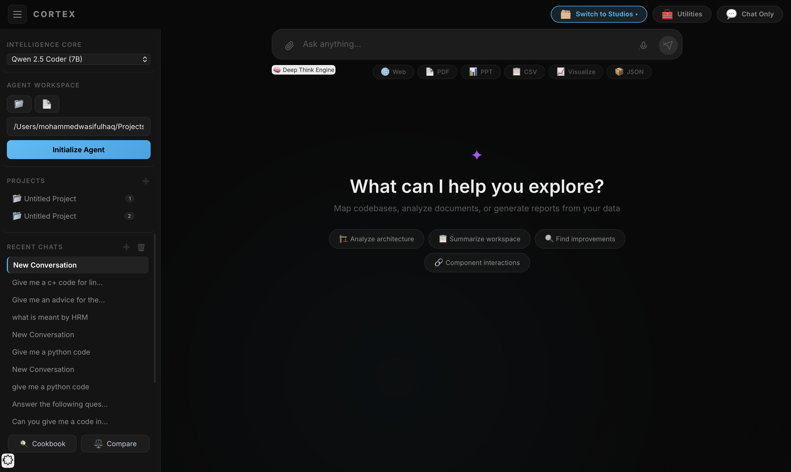
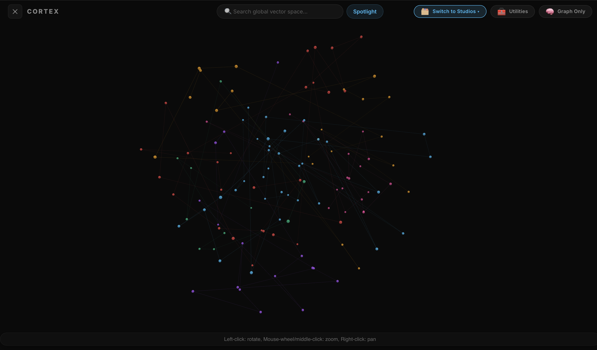
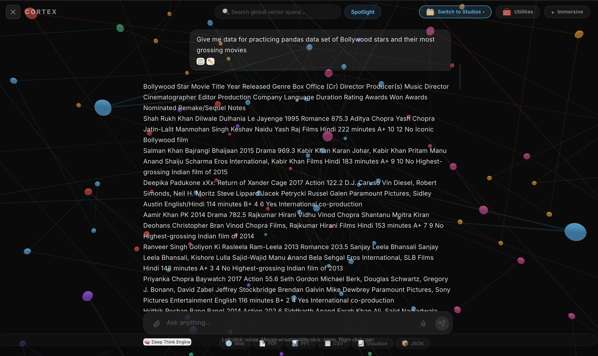
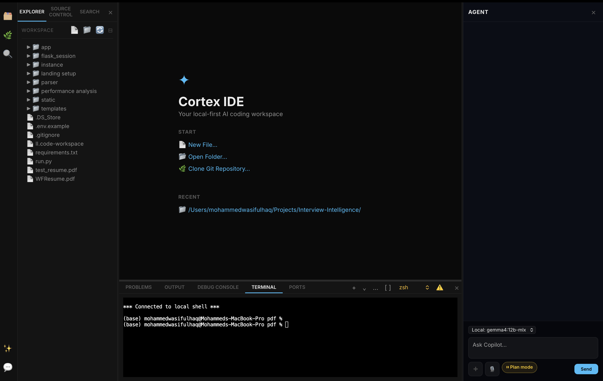
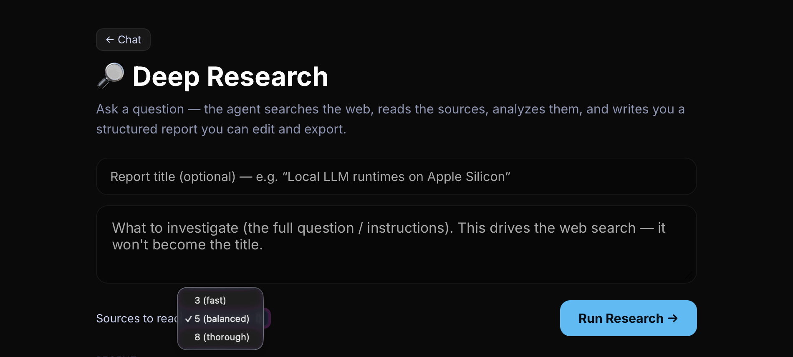
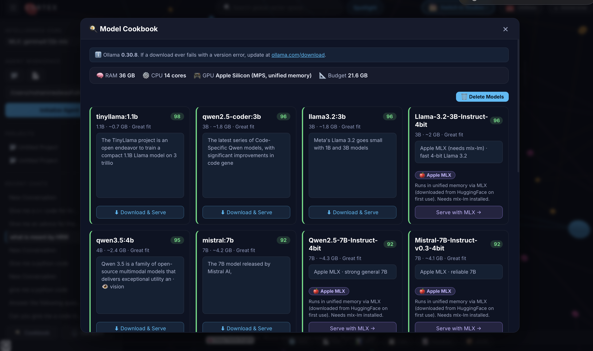
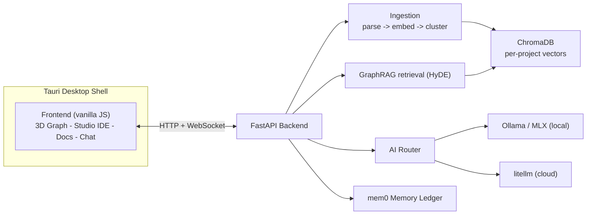

<div align="center">

<!-- TODO: add image → docs/images/banner.png (wide hero banner: logo ✦ + "Cortex IDE") -->


# ✦ Cortex IDE

### A local-first AI Data Intelligence OS

Map your files, code, and databases into an interactive **3D knowledge graph**, interrogate them with **local or cloud LLMs**, and build in a full **VS Code-style Studio** — all running on your own machine.

[](https://www.python.org/)
[](https://fastapi.tiangolo.com/)
[](https://tauri.app/)
[](https://ollama.com/)
[](#-building-the-desktop-app)
[](#-license)

</div>

---

## 📖 Overview

**Cortex IDE** (formerly *Mind Palace*) is a privacy-first desktop application that turns any folder of files into a queryable, spatial knowledge base. It ingests your code, documents, and databases; embeds them into a per-project vector graph; and lets you explore, question, and generate from them — using **local models via Ollama / MLX** or **any cloud provider** through a single API-key box. Everything is processed and stored **on your machine**.

**Why Cortex?**

- 🔒 **Local-first & private** — your files, embeddings, and chat history never leave your device.
- 🧠 **GraphRAG, visualized** — see your codebase as a 3D semantic graph, not a flat search box.
- 🛠️ **One app, four studios** — Immersive chat, a Studio IDE, an Omni-Document editor, and a Deep Research hub.
- 🔌 **Universal AI routing** — local Ollama, Apple MLX, or cloud (OpenAI / Anthropic / Gemini / Groq / xAI). Paste a key — Cortex detects the provider automatically.
- 🚀 **Zero-terminal goal** — ships as a one-click installer; model install/update/delete is built in.

> [!NOTE]
> Cortex is built to run with **[Ollama](https://ollama.com/)** for local models. Cloud providers are optional and configured in-app with your own API key.

---

## ✨ Features

### 🌐 Spatial Mapping & GraphRAG
Point Cortex at a folder and it parses **source code, PDFs, DOCX/PPTX/XLSX, CSVs, and SQLite/`.sql` databases** (with image OCR), embeds everything into a per-project **ChromaDB** vector store, and renders it as an interactive **3D force-graph** with semantic clustering. Incremental SHA-256 caching means only changed files are re-processed.

<!-- TODO: add image → docs/images/graph-3d.png (the 3D semantic graph) -->


### 💬 Immersive Chat with Live Artifacts
Ask questions grounded in your mapped project (HyDE + semantic retrieval). Responses render rich **Markdown, syntax-highlighted code blocks, tables**, and inline **Chart.js** charts & **Mermaid** diagrams. One-click export any answer to **PDF**.

<!-- TODO: add image → docs/images/chat-charts.png (chat answer with an inline chart + code block) -->


### 🧑‍💻 Cortex Studio IDE
A VS Code-style workspace powered by **Monaco**: multi-tab editing, a real **multi-terminal** (split panes + detachable windows), a **~45-language code runner** that uses your installed toolchains, and a **visual debugger** (DAP) with breakpoints, stepping, variables, call stack, and a Debug Console. A built-in **Copilot agent** offers three modes — *Ask permission*, *Accept edits*, and *Plan mode* — with live edits in open editors.

<!-- TODO: add image → docs/images/studio-ide.png (Monaco editor + terminal + Copilot panel) -->


### 📑 Omni-Document Studio & Deep Research
A polymorphic editor opens code in Monaco and documents (`.md`/`.txt`/`.docx`) in a themed **Quill** rich-text editor, with Grammarly-style suggestions and AI ghost-text. The **Deep Research Hub** runs an autonomous agent — web search → page crawl → TF-IDF/KMeans topic analysis → LLM synthesis — streamed straight into your document. Export to **PDF / DOCX**, client- or server-side. All imported HTML is sanitized with **DOMPurify**.

<!-- TODO: add image → docs/images/deep-research.png (Document editor / Deep Research streaming) -->


### 🍳 Model Cookbook & Utilities
A hardware-aware **Model Cookbook** scans your RAM/VRAM and recommends one best-fit model per family, with one-click **install / update / delete** of Ollama models (no terminal). **Model Compare** runs blind A/B tests. A **Utilities** surface adds Notes & Tasks and draft-only Email & Calendar. A persistent **Memory Ledger** (mem0) lets the assistant remember your preferences across sessions.

<!-- TODO: add image → docs/images/cookbook.png (Model Cookbook with fit scores) -->


### 🔌 Universal AI Routing
| Class | How |
|-------|-----|
| **Local** | Ollama over HTTP (streaming) — pick any installed model |
| **Apple MLX** | `mlx-lm` on Apple Silicon (unified memory) |
| **Cloud** | `litellm` — OpenAI, Anthropic, Google Gemini, Groq, xAI, or any `provider/model` |

Paste an API key and Cortex **auto-detects the provider from the key prefix** (`sk-ant-`, `gsk_`, `AIza`, `xai-`, `sk-`) and routes accordingly — no need to match the key to a dropdown.

---

## 🏗️ Architecture

A single **FastAPI** backend serves a vanilla-JS frontend and bundles the ML stack; a **Tauri** shell wraps it as a native desktop app with the backend running as a sidecar.



<!-- TODO (optional): add image → docs/images/architecture.png (a polished architecture diagram) -->

- **WebSocket channels:** `/api/brain/ws` (Copilot agent state machine), `/api/terminal/ws` (real PTY), `/api/dap/ws` (generic debug-adapter proxy).
- **Storage** (local, git-ignored): `backend/storage/` — `cache.db` (diff cache), `chroma_db/` (GraphRAG vectors), `mem0_chroma/` + `mem0.db` (Memory Ledger).

---

## 🧰 Tech Stack

| Layer | Technologies |
|-------|--------------|
| **Backend** | FastAPI - Uvicorn - WebSockets |
| **AI / RAG** | sentence-transformers - ChromaDB - litellm - mem0 - scikit-learn - Ollama / MLX |
| **Parsing** | pypdf - python-docx - python-pptx - openpyxl - pandas - pytesseract (OCR) |
| **Generators** | ReportLab - fpdf2 - python-docx - python-pptx - matplotlib |
| **Voice / Research** | whisper.cpp - faster-whisper - DuckDuckGo Search - BeautifulSoup - readability |
| **Frontend** | Vanilla JS - Monaco Editor - 3D-Force-Graph - Chart.js - Mermaid - Quill - DOMPurify |
| **Desktop** | Tauri 2 (Rust) - PyInstaller sidecar |

---

## 🚀 Getting Started (run from source)

**Prerequisites:** Python **3.11**, [Ollama](https://ollama.com/) running locally (for local models), and optionally Tesseract (image OCR).

```bash
# from the repository root (this folder)
python -m venv .venv && source .venv/bin/activate     # Windows: .venv\Scripts\activate
pip install -r requirements.txt

# start the app (serves the full UI)
uvicorn backend.main:app --port 8077
```

Open **http://localhost:8077** in your browser. Pull a model from the in-app **Cookbook** (or `ollama pull llama3.1:8b`), point Cortex at a folder, and start mapping.

> The first launch downloads a small embedding model and loads the ML stack, so it can take a little while.

---

## 📦 Building the Desktop App

Cortex packages the Python backend with **PyInstaller** and wraps it with **Tauri** to produce a native installer (`.dmg` / `.exe` / `.AppImage`).

### Prerequisites (build machine only — not shipped to users)
- Python env with `requirements.txt` installed
- **PyInstaller** — `pip install pyinstaller`
- **Rust toolchain** — https://rustup.rs
- **Tauri CLI** — `cargo install tauri-cli --version "^2"`
- **App icons** — `src-tauri/icons/` (see the note below)

> [!IMPORTANT]
> The repo does **not** include `src-tauri/icons/`. Generate them once from any square PNG (≥ 1024×1024):
> ```bash
> cargo tauri icon path/to/icon.png
> ```
> This creates `32x32.png`, `128x128.png`, `icon.icns`, and **`icon.ico`** (required for the Windows installer).

### 🪟 Windows `.exe` (PowerShell)

```powershell
# 1) Python backend -> standalone binary
python -m venv .venv; .\.venv\Scripts\Activate.ps1
pip install -r requirements.txt pyinstaller
pyinstaller --noconfirm cortex_backend.spec

# 2) Stage the backend as the Tauri sidecar (Tauri expects the target-triple suffix)
$triple = (rustc -Vv | Select-String 'host:').ToString().Split(' ')[-1]
New-Item -ItemType Directory -Force src-tauri\binaries | Out-Null
Copy-Item "dist\cortex-backend\cortex-backend.exe" "src-tauri\binaries\cortex-backend-$triple.exe"

# 3) Generate icons (first time only), then build the installer
cargo tauri icon path\to\icon.png
cd src-tauri
cargo tauri build
```

The installer lands in **`src-tauri\target\release\bundle\nsis\`** (`.exe`). Run it — no terminal needed by the end user.

### 🍎 macOS / 🐧 Linux

```bash
./scripts/build_installers.sh
# -> src-tauri/target/release/bundle/{dmg,appimage}/
```

> **Voice transcription (optional):** the bundled `backend/workers/whisper.cpp` source must be compiled for your platform (`cmake`) and a model downloaded for speech features; the rest of the app works without it.

---

## ⚙️ Configuration

| Setting | How |
|---------|-----|
| **API keys** | Entered in-app (Intelligence Core panel) — never written to disk or committed |
| `CORTEX_PORT` | Backend port (default `8077`) |
| `CORTEX_HOST` | Backend host (default `127.0.0.1`) |
| `MINDPALACE_STORAGE_DIR` | Override where `cache.db` / `chroma_db` / memory are stored |

In **Settings → Cache & Index** you can monitor index size and **Purge Regional Indexes** (clears the GraphRAG index + diff cache; never your Memory Ledger or notes).

---

## 🗺️ Roadmap

- [ ] Cross-project (multi-folder) graph merging
- [ ] More built-in chart types & dashboards
- [ ] Plugin API for custom tools
- [ ] Signed installers & auto-update

---

## 🤝 Acknowledgements

Built on the shoulders of [Ollama](https://ollama.com/), [litellm](https://github.com/BerriAI/litellm), [ChromaDB](https://www.trychroma.com/), [sentence-transformers](https://www.sbert.net/), [Monaco Editor](https://microsoft.github.io/monaco-editor/), [Tauri](https://tauri.app/), [3D-Force-Graph](https://github.com/vasturiano/3d-force-graph), and [whisper.cpp](https://github.com/ggerganov/whisper.cpp).

---

## 📄 License

Released under the **MIT License**. See [`LICENSE`](LICENSE) for details.

<div align="center">

**Cortex IDE** — your files, your models, your machine.

</div>
